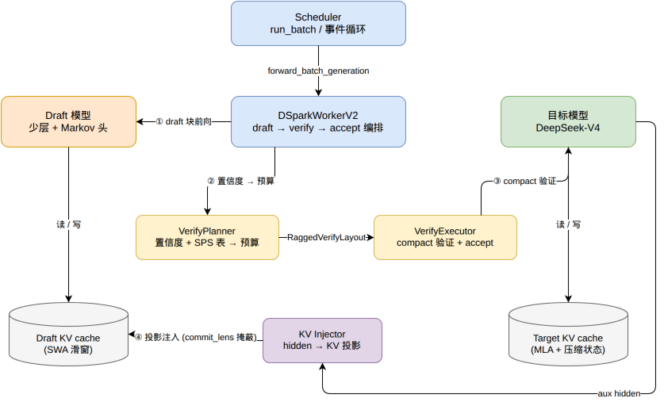
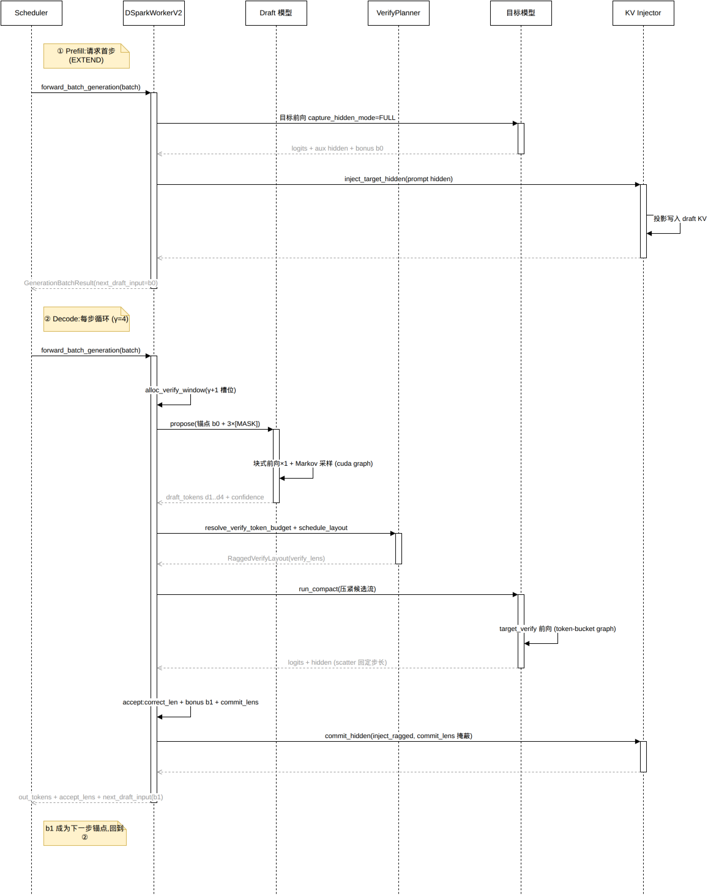
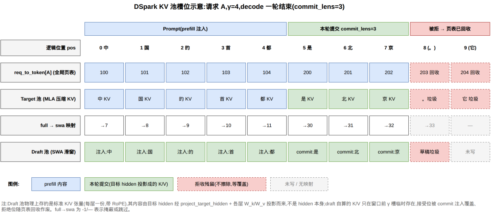
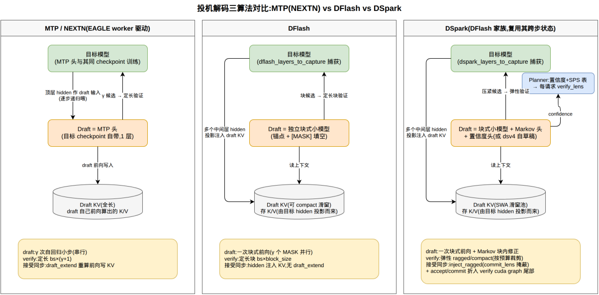

# DSpark 投机解码深度解析笔记

> 基于 sglang 源码走读整理(2026-07)。文中行号以走读时的代码版本为准,后续代码演进可能有偏移,但文件与符号名可直接检索。
> 配套材料:交互式分步讲解页 [`dspark_interactive_walkthrough.html`](./dspark_interactive_walkthrough.html)(浏览器直接打开,含播放/单步/键盘控制)。

---

## 目录

1. [DSpark 是什么](#1-dspark-是什么)
2. [代码地图](#2-代码地图)
3. [一个新请求的完整链路(主线走读)](#3-一个新请求的完整链路主线走读)
4. [数值示例走读(张量级)](#4-数值示例走读张量级)
5. [投机解码在 sglang 框架中的接入架构](#5-投机解码在-sglang-框架中的接入架构)
6. [ModelRunner 拓扑与 cache 协同(MTP / DFlash / DSpark 对比)](#6-modelrunner-拓扑与-cache-协同)
7. [DSpark 与 MTP(NEXTN)的区别](#7-dspark-与-mtpnextn的区别)
8. [DSpark KV 细节问答](#8-dspark-kv-细节问答)
9. [继续深挖的切入点](#9-继续深挖的切入点)

---

## 1. DSpark 是什么

DSpark 是 sglang 中的一种投机解码(speculative decoding)算法,CLI 开关为 `--speculative-algorithm DSPARK`。与所有投机解码一样,基本逻辑是:便宜的 **draft 模型**一次猜出 γ 个 token,昂贵的**目标模型**一次前向并行验证;连续猜对的部分直接提交,第一个猜错处由目标模型给出正确的 **bonus** token。一步最多前进 γ+1 个 token、最少 1 个(bonus),**输出分布与目标模型逐 token 解码严格一致**(接受规则:贪心前缀匹配 / 拒绝采样)。

DSpark 相对 EAGLE 系的三个本质差异:

1. **块式草稿**:draft 不做 γ 次自回归小步,而是**一次块式前向**并行填 γ 个 `[MASK]` 位(所以强制 `speculative_num_steps == 1`),Markov 头做块内链式修正;
2. **语义白嫖**:draft 不重算 prompt,直接把**目标模型多个中间层 hidden 投影注入自己的 KV cache**,prefill 成本 ≈ 0,上下文与目标永远同步;
3. **弹性验证**:验证长度不固定,由**置信度 + SPS 代价表**按请求裁剪(`verify_lens`),压紧(compact)执行,verify 的 FLOPs 只花在"值得验"的 token 上。

再加一条工程主线:**cuda graph 折叠**——draft 采样折进 draft graph 尾部,accept/commit 折进 verify graph 尾部,decode 每步趋近"两次 graph 回放 + 零 host 干预"。

decode 每步的组件交互全景:



---

## 2. 代码地图

### 2.1 核心文件(路径 + 职责)

主干(`python/sglang/srt/speculative/dspark_components/`):

| 文件 | 职责 |
|---|---|
| `dspark_worker_v2.py` | DSpark 总入口 worker,编排 draft → verify → accept 全流程 |
| `dspark_config.py` | 从 draft checkpoint 的 hf config 解析/校验运行时配置(gamma、mask_token_id、markov head 等) |
| `dspark_draft.py` | 草稿阶段:draft 前向、块式采样、draft sampler(可折入 cuda graph) |
| `dspark_verify.py` | 验证阶段:目标 verify 执行器、accept 判定、折入 graph 的 verify epilogue |
| `dspark_planner.py` | 验证预算规划:置信度 + SPS 代价表 → 每请求 ragged verify 长度/布局 |
| `dspark_kv_inject.py` | 把目标模型 aux hidden 投影注入 draft KV cache |
| `dspark_sps.py` | SPS(step-time)代价表数据结构(离线 profile) |
| `dspark_sts.py` | STS(逐位置温度缩放)置信度校准的加载与采集 |
| `dspark_observability.py` | 逐步 info dump、逐位置置信度指标、观察者聚合 |
| `dspark_block_accept_estimator.py` | 在线统计块级接受率(预算校准/日志) |

内核(`dspark_components/kernels/`):

| 文件 | 职责 |
|---|---|
| `dspark_draft_model.py` | 逐步 token 采样、KV 投影提交、堆叠权重 |
| `dspark_accept.py` | 贪心/采样接受、混合接受选择、accept_lens 定稿、cap 修正 |
| `dspark_verify_window.py` | ragged 验证窗口的构建/压紧/散射/输出 token 组装 |
| `dspark_schedule.py` | 按置信度 top-k 调度每请求 verify 长度 |
| `dspark_attn_metadata.py` | DSpark 专用注意力元数据(SWA page indices、块因果 seq_lens) |
| `dispatch.py` | 内核分发开关(fast kernel 开/关) |

模型定义:

| 文件 | 职责 |
|---|---|
| `models/dspark.py` | 密集 draft(Qwen3 底座)+ Markov 头 + 置信度头 |
| `models/deepseek_v4_dspark.py` | DeepSeek-V4(MoE)自带 draft 头的自草稿模型 |
| `models/deepseek_v4.py` | 目标侧:`set_dspark_layers_to_capture` / 前向中捕获 aux hidden(2106、2295-2371、2449 行附近) |

框架接入点:

| 文件 | 职责 |
|---|---|
| `server_args.py` | `speculative_dspark_block_size` / `speculative_dspark_sps_table_path` / `speculative_dspark_confidence_sts_path` 等 CLI 参数 |
| `arg_groups/speculative_hook.py` | `_handle_dspark`:参数校验与派生(强制 num_steps=1、gamma → num_draft_tokens=γ+1) |
| `speculative/spec_info.py` | `SpeculativeAlgorithm.DSPARK` 枚举、`is_dspark()`、`create_worker()` 工厂 |
| `speculative/spec_registry.py` | 插件注册协议(`CustomSpecAlgo`) |
| `managers/scheduler.py` | 创建 draft_worker、驱动每步前向、DSpark 控制命令 |
| `managers/overlap_utils.py` | overlap 调度下 DSpark 的 future/confidence 中继特判 |
| `model_executor/model_runner_components/spec_aux_hidden_state.py` | 解析 draft config 决定目标模型捕获哪些层 |
| `model_executor/model_runner_components/attention_backend_setup.py` | 调用 `model.set_dspark_layers_to_capture(...)` |
| `model_executor/pool_configurator.py` | KV 池容量计算时为 draft KV 留量 |
| `model_executor/runner/decode_cuda_graph_runner.py` | DSpark 稠密 draft 的 attn-TP-local graph 特判、token-bucket 键控 verify graph |
| `layers/attention/deepseek_v4_backend.py` | dsv4 后端中 DSpark draft 块注意力元数据(`init_forward_metadata_dspark_draft_block` 等) |
| `environ.py` | `SGLANG_DSPARK_*` 环境变量(294-307、771 行) |

离线工具与测试:

| 文件 | 职责 |
|---|---|
| `benchmark/dspark_sps_profiler.py` | 离线 profile 生成 SPS 代价表 JSON |
| `benchmark/dspark_sts_fit.py` | 离线拟合 STS 置信度校准 JSON |
| `test/registered/spec/dspark/*.py` | 单测(kernel parity / scheduler / sps 表等) |

### 2.2 核心数据结构(类名 + 文件:行号)

配置:
- `DSparkDraftConfig` — `dspark_config.py:51`(checkpoint 侧 draft 配置)
- `DSparkRuntimeConfig` — `dspark_config.py:68`(gamma / verify 窗口 / mask token)
- `DSparkScheduleConfig` — `dspark_planner.py:914`(ragged verify 调度模式)

worker 与流程对象:
- `DSparkWorkerV2` — `dspark_worker_v2.py:62`(继承 `BaseSpecWorker`,`base_spec_worker.py:45`)
- `DraftBlockProposer` / `DsparkDraftSampler` — `dspark_draft.py:220 / 61`
- `DraftProposal` / `DraftBlockResult` / `DraftForwardResult` — `dspark_draft.py:47 / 33 / 40`
- `TargetVerifyExecutor` / `DsparkVerifyEpilogue` — `dspark_verify.py:64 / 448`
- `TargetVerifyResult` / `AcceptOuts` / `CommitInjectCtx` — `dspark_verify.py:59 / 439 / 431`
- `TargetHiddenKvInjector` — `dspark_kv_inject.py:13`

规划器与预算:
- `DSparkVerifyPlanner` / `VerifyWindow` / `VerifyBudgetDecision` / `HostConfidenceBudgetPlanner` — `dspark_planner.py:59 / 53 / 936 / 1011`
- `SpsCostTable` / `SpsAdditiveCostTable` — `dspark_sps.py:14 / 62`
- `DSparkStsCalibration` — `dspark_sts.py:9`
- `RaggedVerifyLayout` — `speculative/ragged_verify.py:46`(DSpark 独有能力的载体)

跨步状态(复用 DFLASH 家族):
- `DFlashDraftInputV2` — `speculative/dflash_info_v2.py:35`
- `SpeculativeAlgorithm.DSPARK` — `spec_info.py:38`;`is_dflash_family()` 对 DSpark 为真

模型:
- `DSparkDraftModel` / `Qwen3DSparkModel` / `DSparkDraftMixin` — `models/dspark.py:597 / 602 / 363`
- `VanillaMarkov` / `GatedMarkovHead` / `RNNHead` / `DSparkConfidenceHead` — `models/dspark.py:67 / 133 / 164 / 289`
- `DeepseekV4ForCausalLMDSpark` / `DSparkAttention` / `DSparkV4MarkovHead` / `DSparkV4Stage` — `models/deepseek_v4_dspark.py:560 / 75 / 287 / 444`

关键内核类(`kernels/`):
- `SampleStepTokens:17`、`CommitKvProj:202`、`BuildStepLocal:382` — `dspark_draft_model.py`
- `AcceptSampling:22`、`SelectMixedAccept:416`、`AcceptGreedy:558`、`FinalizeAcceptLens:682`、`CapCorrectLen:784` — `dspark_accept.py`
- `BuildRaggedVerifyWindow:20`、`CompactVerifyIds:260`、`ScatterCompactToStrided:452`、`BuildCommitInjectLayout:603`、`BuildOutTokens:762` — `dspark_verify_window.py`
- `ScheduleVerifyLensTopk:19` — `dspark_schedule.py`
- `BuildDsparkSwaPageIndices:63`、`ComputeDsparkWindowGather:23`、`BuildBlockSeqLensCausal:414` — `dspark_attn_metadata.py`

---

## 3. 一个新请求的完整链路(主线走读)

以**非 overlap 调度**为主线(overlap 分支骨架相同,差异在文中标注)。



### 3.1 启动:worker 装配

调度器初始化时,若开启投机解码,`self.model_worker = self.draft_worker`(`scheduler.py:860-864`),即 `DSparkWorkerV2`。此后调度器每步只调 `model_worker.forward_batch_generation(batch)`,不感知内部是普通解码还是三段式投机。`DSparkWorkerV2.__getattr__`(`dspark_worker_v2.py:270-273`)把未定义属性代理给 target worker,调度器读 `max_total_num_tokens` 等字段同样无感。

`DSparkWorkerV2.__init__`(`dspark_worker_v2.py:64-252`)完成:`build_draft_tp_worker` 拉起 draft、`resolve_runtime_config` 解析 gamma/mask_token、`attach_shared_modules` 共享目标的 embed/lm_head(词表矩阵只存一份)、实例化 Planner / Injector / Proposer / VerifyExecutor / Observers。

### 3.2 run_batch 进入 spec-v2 分支

```python
# scheduler.py:3434-3448(非 overlap)
elif not batch.spec_algorithm.is_none():
    resolve_forward_inputs(batch, self.future_map)
    with self._forward_isolation(batch, overlap=False):
        batch_result = self.model_worker.forward_batch_generation(batch)
    batch.spec_info = batch_result.next_draft_input
    if batch_result.new_seq_lens is not None:
        batch.seq_lens = batch_result.new_seq_lens
        ...
```

要点:
- `_forward_isolation` 对 ScheduleBatch 做**快照/恢复**,允许 worker 前向中就地篡改 batch 字段(换 `out_cache_loc`、临时加 `seq_lens`)而不污染调度器;只有白名单(`spec_info`、`new_seq_lens`)带到下一步;
- 投机解码一步可能提交多个 token,`seq_lens` 由 worker 给出而非简单 +1;
- overlap 分支(3334-3372 行)额外传 `on_publish` 回调:worker 在 verify 完成、收尾未跑完时就发布 seq_lens,下一步的 batch 组装与本步尾部 GPU 工作重叠。

### 3.3 Prefill(请求首步)

`forward_batch_generation`(`dspark_worker_v2.py:357-372`)按 `forward_mode` 分发:extend → `_forward_prefill`。`note_non_decode_step` 通知 Planner 打断置信度跨步流水。

1. **目标前向 + 逐层捕获**(`dspark_worker_v2.py:384-397`):以 `CaptureHiddenMode.FULL` 调目标前向,顺带采出首 token b₀。DeepSeek-V4 在逐层循环中命中 `dspark_layers_to_capture` 的层就旁路捕获该层完成后的 hidden(`deepseek_v4.py:2337-2344`);捕获需要每层完整输出,所以**显式跳过 TBO**(2306 行,性能为正确性让路)。
2. **注入 draft KV**(`dspark_worker_v2.py:405-421` → `dspark_kv_inject.py:31`):aux hidden 经 draft 投影写进 draft KV pool 对应槽位;cache_loc **直接复用目标侧 `out_cache_loc`**(两池共用 `req_to_token` 页表)。注入后立刻 `hidden_states = None` 释放大张量。
3. **bonus 闭环**(`dspark_worker_v2.py:423-427`):b₀ 装进 `make_next_draft_input` → `batch.spec_info`。b₀ 双重身份:流式返回用户的第一个 token + 下一步 draft 块的锚点。

设计动机:draft 层数极少,没能力"理解"长 prompt;直接白嫖目标模型的中间层语义,draft 侧 prefill 成本 ≈ 0。

### 3.4 Decode(每步循环)

`_forward_decode`(`dspark_worker_v2.py:477-674`),固定节拍 = 两次大前向:

1. **`alloc_verify_window`**(`dspark_planner.py:832-858`):对每请求查页表 `[prefix_len, prefix_len+γ+1)` 取物理槽位,纯 GPU kernel 零 host 往返。draft 用前 γ 槽,target verify 用全部 γ+1 槽,窗口两阶段复用。
2. **draft 块构造**(`dspark_draft.py:355-360`):`(bs, γ)` 块,第 0 列 = 锚点 b₀,其余 = `mask_token_id`。
3. **draft 一次块式前向**(`dspark_draft.py:377-394`):以 `ForwardMode.TARGET_VERIFY`(定长 extend、可整块进 cuda graph)执行;γ 次小步坍缩成 1 次,launch/元数据/通信开销摊薄 γ 倍(借用 TARGET_VERIFY 的说明见 `spec_info.py:222-228` 的 FIXME)。
4. **Markov 采样 + 置信度**(`dspark_draft.py:274-307`):base logits 经 Markov 头(vanilla/gated/rnn)块内链式修正、逐位采样;快路径下整段折进 draft graph 尾部(`capture_tail_hook`,固定输出缓冲,零拷贝切片读取)。置信度是"存活概率"(P(前 k 个全对)),每行单调递减。
5. **SPS 预算**(`dspark_planner.py:362-380、942-1008`):置信度 + 离线 SPS 代价表算"边际收益 ≥ 边际成本"的全批 verify token 预算。overlap 模式下预算不现算——上一步经 `on_publish` 中继,调度器在组 batch 期(GPU 空转期)预计算(`scheduler.py:3338-3339`),代价是基于滞后 `SGLANG_DSPARK_CONFIDENCE_RELAY_LAG_STEPS=2` 步的置信度。
6. **schedule_layout**(`dspark_planner.py:408-511`):全批统一按置信度 top-k 竞争(`ScheduleVerifyLensTopk` kernel),切出每请求 `verify_lens`(锚点必验,≥1),产出 `RaggedVerifyLayout`。**graph 护栏**:总 token 数向上对齐到已捕获档位(`round_up_grid`),超出捕获网格直接回退全验——省算力永远不把执行踢出 graph 快路径。
7. **压紧 + target verify**(`dspark_verify.py:352-420`):`BuildRaggedVerifyWindow` 把每请求前 `verify_lens[i]` 个候选压成无空洞流;目标前向 token 数 = 实际要验的数量(被裁位置连 attention/MoE 算力都不花);token-bucket 键控 cuda graph 回放。`_run_ragged` 临时替换 `batch.out_cache_loc`、临时加 `seq_lens`(由 isolation 兜底还原)。
8. **scatter 回定步长**(`dspark_verify.py:394-419`):压紧流的 logits/hidden 散射回 `bs×(γ+1)` strided 布局,空洞补 0。意义:下游 accept/finalize/commit kernel 只写一种寻址,static/compact 两路径在此汇合,形状固定可进 graph。
9. **accept**(`dspark_verify.py:110-136`;kernels 在 `dspark_accept.py`):贪心比 argmax、采样走拒绝采样、混合批 `SelectMixedAccept`;`cutoff_layout` 保证接受长度不越过验证边界。`FinalizeAcceptLens` 出 `commit_lens = correct_len + 1` 与 `new_seq_lens`;`BuildOutTokens` 组装输出。
10. **commit 注入**(`dspark_verify.py:282-313` → `dspark_kv_inject.py:105-157`):verify 的 hidden 按 `commit_lens` 注入 draft KV(`BuildCommitInjectLayout` 给未提交位写 −1 跳过);全贪心 + 无 logits 修正时,scatter/accept/commit 整体折进 verify graph 尾部(`DsparkVerifyEpilogue`,`dspark_verify.py:448-651`)。
11. **闭环**(`dspark_worker_v2.py:658-674`):`GenerationBatchResult` 带回 out_tokens / accept_lens / next_draft_input(新 bonus);调度器回写 spec_info / seq_lens,回到第 1 步。

---

## 4. 数值示例走读(张量级)

场景:γ=4(验证窗口 5),page_size=1;dsv4 自草稿(draft 池 SWA)+ DeepSeek-V4 目标(MLA + DSA 压缩状态)。

```text
请求 A:prompt = [中, 国, 的, 首, 都]   (5 token,req_pool_idx=2)
请求 B:prompt = [今, 天, 天, 气]       (4 token,req_pool_idx=5)
```

### 4.1 Prefill(A)

```text
req_to_token[2]: pos 0..4 → slot 100..104
目标前向:aux hidden H₀..H₄ + bonus b₀ = 是
target 池:槽 100-104 = prompt 的 MLA 压缩 KV
draft 池:full→swa 翻译(100→7 … 104→11)后写入 H₀..H₄ 的投影 KV
seq_lens[A] = 5(b₀ 无 KV,只是锚点)
```

### 4.2 Decode 一轮

**窗口分配**:A 的 pos 5..9 → 槽 200..204;B 的 pos 4..8 → 槽 210..214。

**draft 块输入**(本轮第一次 draft 池写入 = "草稿纸"):

```text
draft_block_ids = [[是, M, M, M],
                   [很, M, M, M]]
positions       = [5,6,7,8,  4,5,6,7]
out_cache_loc   = [200..203, 210..213]   ← 窗口前 γ 列;第 5 列 draft 不写
dsv4 draft need_compress=False:c4/c128 压缩状态完全不碰
```

**Markov 采样**:

```text
draft_tokens = [[北, 京, 。, 它],   confidence_A = [0.92, 0.85, 0.40, 0.15]
                [好, 的, !, 今]]   confidence_B = [0.50, 0.20, 0.10, 0.05]
verify_ids  = [[是,北,京,。,它], [很,好,的,!,今]]
```

**预算与裁剪**:假设预算 = 8(全验要 10)。锚点必验(2),剩 6 个名额按置信度全批排序:0.92, 0.85, 0.50, 0.40, 0.20, 0.15 入选 → `verify_lens = [5, 3]`(存活概率单调递减保证 top-k 天然选出前缀)。

**压紧 + verify**:compact 流 8 token(A 全部 5 + B 前 3);target 池写 200-204、210-212 的 MLA KV;**213/214 连目标前向都没进**——这就是弹性验证省下的算力。

**accept**:

```text
A:是→北✓ 北→京✓ 京→,✗(草稿是。) → correct_len=2, bonus=","
B:很→冷✗(草稿是 好)             → correct_len=0, bonus=冷
commit_lens = [3, 1]   new_seq_lens = [8, 5]
out_tokens:A=[北,京,","]  B=[冷]   (本轮 3 请求外共产出 4 个 token)
```

**commit 注入**(本轮第二次 draft 池写入,覆盖草稿纸):

```text
A:swa_loc = [30, 31, 32, -1, -1]   ← 是@5 北@6 京@7;-1 = 掩蔽跳过
B:swa_loc = [35, -1, -1, -1, -1]   ← 很@4
```

**页表回滚**:A 的 pos 8,9(槽 203,204)、B 的 pos 5..8(槽 211..214)归还分配器;两池中的拒收数据**不擦除,等覆盖**。下一轮 A 的窗口分配大概率复用 203/204,新草稿写入即覆盖旧垃圾。

### 4.3 一轮结束的槽位终态



| 逻辑槽 | 页表归属 | target 池 | draft 池(经 full→swa) | 状态 |
|---|---|---|---|---|
| 100-104 | A pos 0-4 | prompt MLA KV | 目标 hidden 投影成的 K/V(prefill 注入) | 存活 |
| 200-202 | A pos 5-7 | 是/北/京 KV | swa30-32:commit 注入 K/V | 存活 |
| 203-204 | 已回收 | 。/它 KV(垃圾) | swa33 草稿垃圾 / 未写 | 等覆盖 |
| 210 | B pos 4 | 很 KV | swa35:commit 注入 K/V | 存活 |
| 211-214 | 已回收 | 好/的 KV(垃圾)/ 未写 | 草稿垃圾 / 未写 | 等覆盖 |

---

## 5. 投机解码在 sglang 框架中的接入架构

### 5.1 总枢纽:枚举 + 插件注册表

所有算法只有一个身份:`SpeculativeAlgorithm`(`spec_info.py:30-44`,含 DFLASH / DSPARK / EAGLE / EAGLE3 / FROZEN_KV_MTP / STANDALONE / NGRAM / NONE)。框架各处**从不 import 具体算法**,只调用枚举上的两类接口:

- **能力谓词**:`is_dspark()` / `supports_ragged_verify()` / `supports_grammar_overlap()` / `has_draft_kv()` ……调度器、ModelRunner、注意力后端全部据此分支,无 isinstance;
- **工厂**:`create_worker(server_args)` 返回 worker 类(内部 lazy import);`handle_server_args_by_algo()` 分发参数钩子。

第三方算法经 `SpeculativeAlgorithm.register("MY_SPEC")` 注册(`spec_registry.py:218`),得到鸭子类型的 `CustomSpecAlgo`;注册时 `_assert_custom_spec_algo_conforms`(`spec_registry.py:183`)强校验插件类实现了枚举的全部 `is_*`/`supports_*` 谓词,防止接口漂移;内置名与别名(`NEXTN`)是保留字。

### 5.2 与 Scheduler 的串联

三个注入点:

1. **参数解析期**:`handle_speculative_decoding`(`speculative_hook.py:64`)先做别名归一(`NEXTN → EAGLE`;Gemma4 draft 时升为 `FROZEN_KV_MTP`,52-59 行),再分发 `_handle_dspark` 等钩子——算法的"启动期个性"全部收敛在这一个文件。
2. **worker 装配与生命周期**(`scheduler.py:845-852`):统一五元组构造签名 `(server_args, gpu_id, ps, nccl_port, target_worker)`;显存/后端/graph 初始化拆成三个显式阶段(`alloc_memory_pool → init_attention_backends → init_cuda_graphs`)由调度器编排,因为 draft 池大小依赖目标池、graph 捕获依赖后端就绪,是跨 worker 的全局约束。之后 `model_worker = draft_worker` 完成"偷梁换柱"。
3. **每步双向契约**:入参 `ScheduleBatch`(带 `spec_info` 跨步状态,页表已按 γ+1 预留)+ overlap 时的 `on_publish` / `grammar_barrier`;返回 `GenerationBatchResult`(`next_token_ids` / `accept_lens` / `new_seq_lens` / `next_draft_input`)。中间的 batch 就地篡改由 `_forward_isolation` 快照兜底。

### 5.3 与 ModelRunner 的串联

ModelRunner **不认识算法,只认识模式**,感知面收敛为三样:

1. 两个标量:`spec_algorithm` + `is_draft_worker`(`model_runner.py:270-277`)——同一个类既跑目标也跑 draft,差异只体现在池容量、aux 捕获配置、graph 档位等配置分支;
2. 两个专用 `ForwardMode`:`TARGET_VERIFY` 与 `DRAFT_EXTEND_V2`(`forward_batch_info.py:110-112`)——投机解码对底层不是"一种算法"而是"两种前向形状",后端按模式实现元数据;
3. `ForwardBatch.spec_info`(`SpecInput` 基类,`spec_info.py:313-326`)——算法私有数据的唯一过境通道;后端/graph runner 只读基类通用字段(`num_tokens_per_req`、`ragged_verify_layout`)。新能力走"基类加字段 + 枚举加谓词",不让底层认识新算法。

### 5.4 算法组织

`BaseSpecWorker`(`base_spec_worker.py:45`)定义契约:target/draft worker 属性、三阶段生命周期(默认转发)、权重热更新、默认 no-op 的回调钩子(`on_verify_complete_cpu` / `note_request_finished` / `activate_step_by_batch`)。

目录组织三条复用线:
- 每算法 = worker + info(SpecInput 子类)+ 可选专用 graph runner 三件套;体量大的(DSpark)升级为子包;
- **家族复用**:EAGLE/EAGLE3/NEXTN/STANDALONE 共用 `eagle_worker_v2` 骨架;DSpark 声明 `is_dflash_family()`,复用 DFLASH 的 `DFlashDraftInputV2` 与 aux 捕获通路;
- 共享件下沉:`draft_worker_common.build_draft_tp_worker`、`ragged_verify.RaggedVerifyLayout` 放包顶层。

---

## 6. ModelRunner 拓扑与 cache 协同

### 6.1 一个还是两个 ModelRunner?

**标准形态两个**(target + draft),同一个 `ModelRunner` 类、仅 `is_draft_worker` 不同(`tp_worker.py:424-431`):

```text
Scheduler
├── tp_worker: TpModelWorker ────► target ModelRunner (is_draft_worker=False)
└── draft_worker: XxxWorkerV2(持 target_worker 引用)
        └── 内部自建 TpModelWorker ────► draft ModelRunner (is_draft_worker=True)
```

例外:NGRAM 无 draft 模型只有 1 个;多层 EAGLE 的 draft 侧每 step 一个(`tp_worker.py:438-457`)。ModelRunner 本身不知道自己在配合谁——一切协同发生在上层 spec worker。

### 6.2 cache 协同骨架(三算法同构)

1. **`req_to_token` 页表全局一张**(`tp_worker.py:368-370`):同一(请求,逻辑位置)在两池解析到相同槽号;
2. **分配器全局一个**(371-373 行):分配/回收决策只做一次;
3. **KV 数据缓冲各持一份**:draft 按自己的层数/形状建 buffer,索引空间与 target 对齐;
4. **容量在 target 侧一次算清**:`pool_configurator` 放大 cell_size 涵盖 draft 那份——EAGLE 系按层数比(135-151 行,隐含 draft/target 每层 KV 同尺寸),DFLASH 家族走 `scale_kv_cell_size_per_token_for_dflash`(153-169 行);
5. **回收由调度器统一做**:`clear_cache_pool` 默认 no-op,按 `new_seq_lens` 收页表,拒收数据不擦除。

### 6.3 三算法对比



| 维度 | MTP(NEXTN→EAGLE) | DFlash | DSpark |
|---|---|---|---|
| ModelRunner 数 | 2(多层变体 1+num_steps) | 2 | 2 |
| worker 结构 | `EAGLEWorkerV2` → `EagleDraftWorker` → TpModelWorker | `DFlashWorkerV2` 直持 `build_draft_tp_worker` bundle | 同 DFlash |
| hidden 串联 | 目标**顶层** hidden 作 draft **输入**(逐步递归) | 目标**多中间层** hidden **注入 draft KV** | 同 DFlash;注入器独立成 `TargetHiddenKvInjector`,MLA 路径带 full→SWA 翻译 |
| draft KV 内容 | draft 自己前向算出的 K/V | 注入的目标语义 K/V + draft 块前向临时 K/V | 同 DFlash |
| 接受 token 同步 | `draft_extend` 重算 draft 前向写 KV(第二个抽象方法+专用 graph) | verify hidden 按 `commit_lens` 注入,不跑 draft | 同 DFlash;ragged 掩蔽 + 可折进 verify graph 尾部 |
| draft KV 容量 | 层数比例放大;全长 | cell_size 缩放;可 compact 滑窗(`draft_window_size`) | SWA 滑窗池(`full_to_swa_index_mapping`) |
| verify | 定长(EAGLE 可树形 topk>1;NEXTN 链式) | 定长块 | 弹性 ragged/compact(置信度 + SPS 预算) |

一句话:三者在 cache 骨架上完全同构,**分岔在 hidden 的用法**——MTP 把目标 hidden 当 draft 的"输入"(所以要 draft_extend 重算维持 draft KV),DFlash/DSpark 把它当 draft 的"记忆"直接写 KV(同步只是一次注入 kernel);DSpark 再叠加滑窗池与 ragged commit。

---

## 7. DSpark 与 MTP(NEXTN)的区别

术语落点:sglang 中 MTP(DeepSeek 的多 token 预测头)对应 `NEXTN` 算法,而 NEXTN 启动时归一化为 EAGLE 跑(`speculative_hook.py:52-59`),draft 模型是 `DeepseekModelNextN`(`models/deepseek_nextn.py`)。所以对比实质是 **DSpark vs "MTP 头 + EAGLE 式链式投机"**。

| 维度 | MTP(NEXTN) | DSpark |
|---|---|---|
| draft 是什么 | 目标 checkpoint **自带**的 1 层 MTP 头 | 独立训练小模型(Qwen3+Markov 头)或 dsv4 内嵌 draft |
| 怎么猜 γ 个 | **自回归小步**:draft 前向 × num_steps,链式串行 | **一次块式前向**:锚点+γ−1 个 MASK 并行,Markov 修正;num_steps 强制 1 |
| draft 上下文 | 每步目标顶层 hidden 递归喂入,无独立长上下文 | 目标多中间层 hidden 注入 draft 自己的(滑窗)KV,持续同步 |
| 验证 | 定长验证(NEXTN 链式 topk=1) | 弹性验证(置信度+SPS 预算、压紧执行),唯一携带 `RaggedVerifyLayout` 的算法 |
| 跨步状态 | `EagleDraftInput` / `EagleVerifyInput` | `DFlashDraftInputV2`(DFLASH 家族复用) |

三个最本质差异:① 串行小步 vs 并行一步(draft 成本结构);② draft 的知识来源(顶层 hidden 递归传递 vs 中间层语义快照注入);③ 验证定长 vs 弹性。另注意仓库里还有 `FROZEN_KV_MTP`(`spec_info.py:41`,Gemma4 assistant draft 专用变体),勿与 NEXTN 混淆。

---

## 8. DSpark KV 细节问答

### Q1:每轮草稿模型的输入是什么?

四部分(`dspark_draft.py:340-394`):
- token 块 `(bs, γ)`:第 0 列 = 上一步 bonus(锚点),其余 = `mask_token_id`;
- embedding:共享目标 `embed_tokens`(draft 实现 `forward_embed` 时在 graph 内查;dsv4 沿 hc 维复制);
- positions = `prefix_len + [0..γ)`;`out_cache_loc` = verify 窗口前 γ 槽;
- 注意力上下文 = draft KV 池中历史注入的目标语义 K/V;块内 block-causal(`BuildBlockSeqLensCausal`)。

**输入 token 几乎不含信息,draft 的知识全在池子里。**

### Q2:每轮往 KV 池写什么?

**两次写,语义不同**:
1. draft 块前向的"草稿纸":注意力层照常把 γ 个位置自算的 K/V 写到窗口前 γ 槽(块内 attention 需要),无长期价值;
2. verify 后 commit 注入(覆盖第一次):目标 hidden 经 `write_target_hidden_kv` 投影写进 `[0, commit_lens)`。

**draft 池长期留存的内容永远是目标 hidden 的投影**;draft 自算 K/V 接受位当步被覆盖、拒绝位随页表作废。

### Q3:dsv4 这类分层异构 cache 怎么管理?

- **目标池** `DeepSeekV4TokenToKVPool`(`deepseek_v4_memory_pool.py`)本身异构:MLA 压缩 KV + DSA 的 c4/c128 压缩状态环(`CompressStatePool`)+ SWA 子池,`layers_mapping` 做全局层号→子池映射;
- **draft 池纯 SWA**:draft 注意力(`DSparkAttention`,MQA)只在滑窗内工作;全局页表给 full 槽号,写前经 `full_to_swa_index_mapping` 翻译(滑出窗口的槽映射到哨兵 0,写入自动 no-op);
- **draft 前向不碰压缩状态**:dsv4 后端为 DSpark draft 块构造元数据时 `need_compress=False`(`deepseek_v4_backend.py:938-940`);
- 容量仍是 target 侧一次算清(DFLASH 家族专用换算)。

### Q4:草稿 token 被拒绝,KV 怎么处理?

三层:
1. **普通 KV 槽(无状态)**:不擦除。页表按 `new_seq_lens` 回滚,数据原地等覆盖,零 GPU 写;
2. **draft 池注入边界**:写入时就掩蔽——`set_kv_buffer_prefix_valid` 按 commit_lens 截断 / `BuildCommitInjectLayout` 给未提交位 `swa_loc = −1`;
3. **有状态的压缩状态(dsv4 目标侧 c128 环)**:唯一必须显式清理的——增量累积的 max/sum 环,被拒 token 的贡献不清会污染后续。专用 kernel `clear_unaccepted_c128_draft_states`(`jit_kernel/dsv4/c128_cleanup.py`);投机模式下环也被放大(c4 8→16、c128 128→256,`deepseek_v4_memory_pool.py:34-48`)。该清理的显式调用点在 EAGLE/MTP 的 verify 路径(`eagle_worker_common.py:615-625`);DSpark 的 draft 侧因 `need_compress=False` 从源头无此问题,target verify 侧走独立的 `_make_target_verify_c128_metadata`(`deepseek_v4_backend.py:626-633`,prefill 风格构造)——其被拒 token 的确切处理路径在 `compressor_v2` 内,未逐行验证。

### Q5:draft 模型包含 attention 吗?

**包含,且是必需品**。密集 draft 的骨干是标准 decoder 层(`DFlashDecoderLayer.self_attn`,`models/dflash.py:277-312`);dsv4 自草稿是 `DSparkAttention`(MQA 滑窗,`models/deepseek_v4_dspark.py:75`)。attention 干两件事:让 MASK 位读上下文(注入的目标语义 KV)+ 块内因果(块内预测彼此协调)。没有 attention,draft 退化为单 token 查表。

### Q6:draft KV 存的是 hidden states 吗?

**不是。存的是投影后的标准 K/V 张量**。链路(`models/dspark.py:505-550`):

```text
target_hidden → project_target_hidden(适配投影到 draft hidden 空间)
             → 逐层 kv_proj_only(各层自己的 W_k/W_v)
             → apply_k_norm → apply_k_rope(位置烤入 K)
             → [num_kv_heads, head_dim] 的 K、V → pool.set_kv_buffer
```

为什么不存 hidden:paged attention kernel 按 K/V 布局直接读(存 hidden 则每次 attention 都要现场投影,读写比极差);RoPE 位置相关,必须写入时烤进 K。

**反常规设计**:正常 transformer 第 i 层的 K/V 来自第 i 层自己的输入 hidden;注入路径里**所有层的 K/V 都从同一份 `ctx_hidden` 投影**(各层只差投影权重)——这是训练时固定的约定。代码利用"输入共享"把所有层的 KV 投影权重拼成一个大矩阵、注入变一次 GEMM(`_stacked_ctx_kv_params`,`models/dspark.py:469-503`)。

| 写入来源 | 各层 K/V 的来源 hidden | 寿命 |
|---|---|---|
| prefill / commit 注入 | 同一份 `ctx_hidden`(目标 hidden 投影),各层只差投影权重 | 长期(draft 的上下文记忆) |
| draft 块前向自写 | 每层自己的真实输入 hidden(常规路径) | 步内临时 |

dsv4 版同逻辑的 MQA 形态:`CommitKvProj` 一次算全 stage KV + `set_swa_key_buffer_radix_fused_norm_rope` 融合 kernel(`models/deepseek_v4_dspark.py:654-678`)。

---

## 9. 继续深挖的切入点

1. **预算算法**:`dspark_planner.py` 的 `compute_verify_token_budget`(SPS 表如何换算成边际决策)与 overlap 滞后中继(`HostConfidenceBudgetPlanner`);
2. **Graph 折叠机制**:`DsparkVerifyEpilogue.capture_hook` 如何把 scatter/accept/commit 缝进 verify graph 尾部(`dspark_verify.py:448-651`);
3. **Markov 头数学**:`models/dspark.py` 三种头(vanilla/gated/rnn)的块内自回归公式差异;
4. **dsv4 压缩状态与 ragged verify 的交互**:`layers/attention/dsv4/compressor_v2.py` 的 `create_paged_compressor_data` / `FusedCompressMetadata`;
5. **DP-attention 下的档位对齐**:`dp_global_verify_tier_num_tokens` 与各 rank graph 同构约束。

---

## 附:一图流总结

**DSpark 的四条设计主线**:① 块式草稿(γ 次小步 → 1 次,发射开销摊薄 γ 倍);② 语义白嫖(目标中间层 hidden 注入 draft KV,draft 无 prompt 成本、上下文永远同步);③ 弹性验证(置信度+SPS 表 → 每请求 verify_lens,压紧执行);④ Graph 折叠(采样折进 draft graph 尾、accept/commit 折进 verify graph 尾,decode 步 ≈ 两次 graph 回放)。四条主线指向同一个目标:**让昂贵的目标模型每次前向物尽其用,让便宜的部分(draft、调度、host 逻辑)彻底退出关键路径。**
